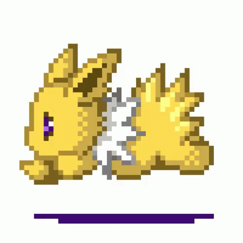

  

  

<h3 align="center">Hey there, I’m Kevin (he/him) 👋</h3>

I am currently a software engineer intern @ <strong>Boeing Vancouver</strong> working on <strong>Flight Data Analytics (FDA)</strong> 📈. I am passionate about game development 🎮, advancements in artificial intellegence 👨‍💻, and music 🎵: 

&nbsp;

## 📌 Pinned
|  [Oh Shit, Git!?! (A lifesaver)](https://ohshitgit.com/) |  [Devpost](https://devpost.com/KeveenWong?ref_content=user-portfolio&ref_feature=portfolio&ref_medium=global-nav) |
|------------------------|-------------------------------------------------------------------------------------------------------|

<!--
**KeveenWong/KeveenWong** is a ✨ _special_ ✨ repository because its `README.md` (this file) appears on your GitHub profile.

Here are some ideas to get you started:

- 🔭 I’m currently working on ...
- 🌱 I’m currently learning ...
- 👯 I’m looking to collaborate on ...
- 🤔 I’m looking for help with ...
- 💬 Ask me about ...
- 📫 How to reach me: ...
- 😄 Pronouns: ...
- ⚡ Fun fact: ...
-->
